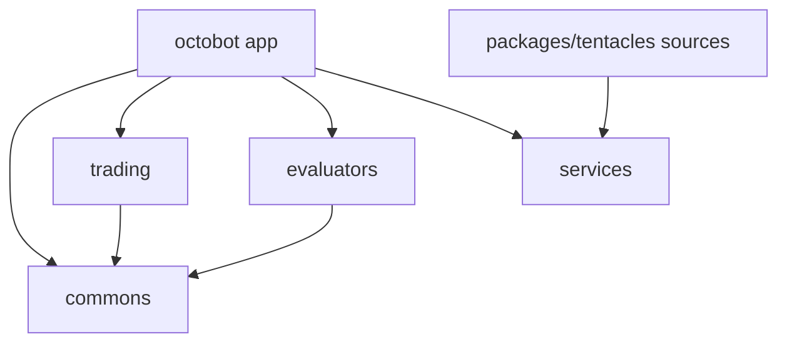

# Agent quick pointer (OctoBot repo)

This repository is the **OctoBot** application and its `packages/*` monorepo. Default integration branch: **`dev`** (open PRs to `dev` unless told otherwise).

## Cursor Cloud

- Environment: [`.cursor/README.md`](.cursor/README.md), `environment.json`, `source .cursor/env.sh`
- Skill (procedures): `.cursor/skills/octobot-cloud/SKILL.md`
- Always-on rules: `.cursor/rules/octobot-cloud.mdc`

## Before you finish

```bash
source .cursor/env.sh
python -m tools.extended_linter --base origin/dev
```

Use `origin/<base>` matching your PR target. Policy: `tools/extended_linter/config/policy.yaml` — see `tools/extended_linter/ARCHITECTURE.md`.

## Architecture for agents

Colocated **`AGENTS.md`** files describe package boundaries (owns, deps, tests). They are for automation; human docs live under `docs/content/` (Docusaurus).

### When to read

| Situation | Read |
|-----------|------|
| Single package task | `packages/<name>/AGENTS.md` |
| Core app / CLI / config | [`octobot/AGENTS.md`](octobot/AGENTS.md) |
| Tentacles sources vs install | [`packages/tentacles/AGENTS.md`](packages/tentacles/AGENTS.md) |
| Cross-package or tentacles | This file + every involved colocated `AGENTS.md` |

### Dependency sketch



### CI matrix packages (colocated `AGENTS.md`)

| Package | Path |
|---------|------|
| Core application | [`octobot/AGENTS.md`](octobot/AGENTS.md) |
| Tentacles sources | [`packages/tentacles/AGENTS.md`](packages/tentacles/AGENTS.md) |
| agents | [`packages/agents/AGENTS.md`](packages/agents/AGENTS.md) |
| async_channel | [`packages/async_channel/AGENTS.md`](packages/async_channel/AGENTS.md) |
| backtesting | [`packages/backtesting/AGENTS.md`](packages/backtesting/AGENTS.md) |
| commons | [`packages/commons/AGENTS.md`](packages/commons/AGENTS.md) |
| copy | [`packages/copy/AGENTS.md`](packages/copy/AGENTS.md) |
| evaluators | [`packages/evaluators/AGENTS.md`](packages/evaluators/AGENTS.md) |
| flow | [`packages/flow/AGENTS.md`](packages/flow/AGENTS.md) |
| node | [`packages/node/AGENTS.md`](packages/node/AGENTS.md) |
| protocol | [`packages/protocol/AGENTS.md`](packages/protocol/AGENTS.md) |
| services | [`packages/services/AGENTS.md`](packages/services/AGENTS.md) |
| sync | [`packages/sync/AGENTS.md`](packages/sync/AGENTS.md) |
| tentacles_manager | [`packages/tentacles_manager/AGENTS.md`](packages/tentacles_manager/AGENTS.md) |
| trading | [`packages/trading/AGENTS.md`](packages/trading/AGENTS.md) |

New packages: follow **AGENTS.md sections** in [CONTRIBUTING-agent.md](CONTRIBUTING-agent.md).

## Humans

- [CONTRIBUTING-agent.md](CONTRIBUTING-agent.md) — agents, policy, boundaries
