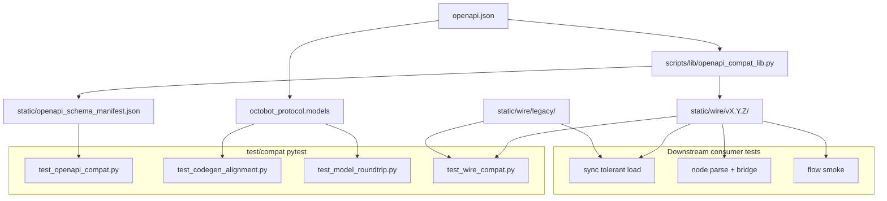

# Protocol backwards-compat tests

Hand-written pytest suite and committed static assets that gate changes to [`openapi.json`](../../openapi.json). This directory lives under [`../`](../../test/) and is **not** cleaned by `npm run generate:python` (only root-level generated `test/test_*.py` are removed).

Run from `packages/protocol`:

```bash
pytest test                    # all protocol tests (~177)
pytest test/compat             # compat only (41 tests)
npm run test:compat            # same
npm run test:pytest            # same as pytest test
```

Downstream packages resolve wire fixtures via `scripts.lib.openapi_compat_lib.wire_root_dir()`.

## Purpose

- Catch **breaking** OpenAPI edits before they reach sync, node, and flow consumers.
- Keep **wire JSON** fixtures aligned with what `octobot_protocol.models` actually serializes.
- Complement the ~136 generated model tests at `test/` root (generator output; compat tests assert cross-package contract).

## Architecture



## Test layers

| Layer | Where it runs | Role of `test/compat` |
|-------|----------------|------------------------|
| Schema contract | `test_openapi_compat.py` | Live manifest vs committed baseline; breaking vs stale manifest |
| Codegen alignment | `test_codegen_alignment.py` | Every OpenAPI schema has a generated model and module file |
| Model roundtrip | `test_model_roundtrip.py` | Minimal instances parse and `to_json()` roundtrip |
| Wire strict | `test_wire_compat.py` | Fixtures parse, catalog complete, legacy rules, CLI `--check` |
| Tolerant load | `packages/sync/tests/protocol/test_wire_compat.py` | Reads same `static/wire/` via `wire_root_dir()` |
| Bridge / smoke | `packages/node`, `packages/flow` | Same wire dir; node also tests outbound bridges |

## Static assets

### Schema manifest

[`static/openapi_schema_manifest.json`](static/openapi_schema_manifest.json) is a structural fingerprint of `openapi.json`.

- Regenerated with `python -m scripts.build_openapi_schema_manifest`
- **Non-breaking** OpenAPI change: update manifest in the same PR (`StaleManifestError` otherwise)
- **Breaking** change: test fails with breaking-diff messages; add migrations and wire promotion before merging

### Wire fixtures

[`static/wire/`](static/wire/) holds versioned JSON consumed by compat tests and downstream packages.

```
wire/
  active_version.json
  v1.0.0/
    strategies_state.json
    ...
    user_actions/
  legacy/
    strategy_grid_configuration.json
    v*/
    ad_hoc/
```

- Built with [`scripts/build_wire_fixtures.py`](../../scripts/build_wire_fixtures.py)
- Legacy rules in [`legacy_fixture_expectations.py`](legacy_fixture_expectations.py)

## Supporting code

| File | Role |
|------|------|
| [`__init__.py`](__init__.py) | Package marker (`test.compat.*` imports) |
| [`legacy_fixture_expectations.py`](legacy_fixture_expectations.py) | Legacy wire path rules |
| [`scripts/lib/openapi_compat_lib.py`](../../scripts/lib/openapi_compat_lib.py) | Manifest, minimal instances, `wire_root_dir()` |
| [`scripts/build_openapi_schema_manifest.py`](../../scripts/build_openapi_schema_manifest.py) | Manifest CLI |
| [`scripts/build_wire_fixtures.py`](../../scripts/build_wire_fixtures.py) | Wire fixture CLI |

## Test modules

| Module | What it checks |
|--------|----------------|
| `test_openapi_compat.py` | Committed manifest matches live `openapi.json` |
| `test_codegen_alignment.py` | OpenAPI schemas ↔ generated models |
| `test_model_roundtrip.py` | Per-schema roundtrip smoke |
| `test_wire_compat.py` | Fixture freshness, parse/roundtrip, catalog, legacy registry |

### Test tooling (`test_testing_tools/`)

| Module | What it checks |
|--------|----------------|
| `test_openapi_breaking_detector.py` | Manifest diff classification |
| `test_wire_fixture_builder.py` | Wire fixture builder helpers and promote workflows |

## When you change `openapi.json`

1. `npm run generate:python`
2. `python -m scripts.build_openapi_schema_manifest`
3. `npm run generate:fixtures`
4. `pytest test`

Full workflow: [package README — Backwards compatibility workflow](../../README.md#backwards-compatibility-workflow).
