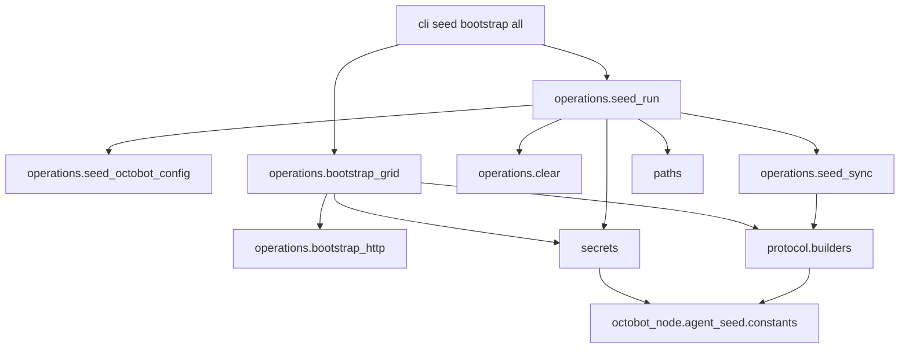

# agent_seed architecture

Demo-only fixture tooling for Cloud / local Node UI QA. Insecure committed wallet in `secrets.py` — never use in production.

## Operator documentation

- Canonical guide: [README.md](README.md)
- Agent procedure: skill **agent-seed** (`.cursor/skills/agent-seed/SKILL.md`)
- Bootstrap polls debug `user_actions` and fails fast on FAILED create-automation (`operations/bootstrap_grid.py`)

## Phases



## Layout

| Path | Role |
|------|------|
| `paths.py` | Repo root, env path resolution, marker file name |
| `secrets.py` | `DEMO_INSECURE_*` key material only |
| `protocol/builders.py` | Kraken sim + grid/index protocol objects |
| `operations/clear.py` | Sqlite-first wipe |
| `operations/seed_sync.py` | Wallet import + sync collection writes |
| `operations/seed_run.py` | `run_seed`, idempotency |
| `operations/seed_octobot_config.py` | `config.json` readonly overlays to master `user/` |
| `operations/bootstrap_http.py` | Debug API HTTP helpers |
| `operations/bootstrap_grid.py` | Grid automation bootstrap |
| `cli/` | Argparse only |
| `__main__.py` | Entry: `python -m tools.agent_seed` |

Runtime sandbox (`is_demo_agent_seed_user`, validation in `demo_wallet.py`) lives in `octobot_node/agent_seed/` — not in this package. **`POST /api/v1/debug/`** in `tentacles/.../node_api_interface/api/routes/debug.py` calls `validate_demo_agent_seed_user_action` before enqueueing user actions (GET debug unchanged).

## Import boundaries

| Module | May import | Must not import |
|--------|------------|-----------------|
| `secrets.py` | `octobot_sync.auth.provider`, `octobot_node.agent_seed.constants` | tentacles, CommunityAuthentication, HTTP |
| `protocol/builders.py` | `octobot_protocol`, tentacles, `octobot_copy.enums`, node constants | `operations`, `cli`, sync providers |
| `paths.py` | stdlib | `octobot_*` |
| `operations/clear.py` | node constants (message prefix) | tentacles, CLI |
| `operations/seed_sync.py`, `seed_run.py` | sync, CommunityAuthentication, `protocol.builders`, `operations.clear`, `secrets`, `paths`, node constants | HTTP debug |
| `operations/seed_octobot_config.py` | `octobot_commons.constants`, `paths` | tentacles, CLI |
| `operations/bootstrap_*.py` | `protocol.builders`, `secrets`, node constants, urllib | CollectionProviders |
| `cli/*` | `operations`, `paths` | tentacles |
| `__main__.py` | `cli` | direct `operations` |

**Rule:** `tools.agent_seed` may import `octobot_node.agent_seed.constants` (and OctoBot runtime libs for seeding). Node must not import `tools`.

## Tests

Mirror under `tools/tests/agent_seed/` (`paths/`, `protocol/`, `operations/`). Demo guard tests stay in `packages/node/tests/agent_seed/`.

**CI:** OctoBot-CI job `extended_linter` runs `PYTHONPATH=.:$PYTHONPATH pytest tools/tests` (wheel + tentacles in that job).

```bash
source .cursor/env.sh
PYTHONPATH=.:$PYTHONPATH pytest tools/tests/agent_seed/ packages/node/tests/agent_seed/ -q
```
