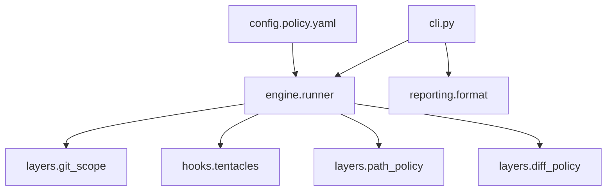

# extended_linter architecture

## Execution order

1. **Load policy** — `config.loader.load_policy`
2. **Git layer** — verify `--base` ref; list changed paths + unified diff
3. **Tentacles hook** — if `packages/tentacles/**` in diff, run `reinstall-tentacles.sh` (not a policy violation). Requires cloud install / `env.sh`. **CI** passes `--skip-tentacles-reinstall`; agents run the hook by default.
4. **Path layer** — `layers.path_policy.run(changed_paths, policy)`
5. **Diff layer** — `layers.diff_policy.run(diff_text, policy)`
6. **Report** — `reporting.format` in CLI

## RunContext

`engine.context.RunContext` holds `repo_root`, `base_ref`, `policy`, `changed_paths`, `merge_base_sha`, `diff_text`, and accumulated `violations`. Extend the engine if new shared state is needed — do not pass globals.

## Import boundaries

| Module | May import |
|--------|------------|
| `cli.py` | `config.loader`, `engine.runner`, `reporting.format` |
| `engine.runner` | `config`, `layers`, `hooks`, `domain` |
| `layers/*` | `domain` only (git layer may use `subprocess`) |
| `hooks/*` | `domain.paths`; `subprocess` for scripts |
| `reporting/*` | `domain.models` |
| `config.loader` | PyYAML only |

**Anti-patterns**

- New Python files at `tools/extended_linter/*.py` (except `cli.py`, `__main__.py`).
- `subprocess` inside path/diff layers.
- Enforceable rules only in agent skills (use `config/policy.yaml`).

## Where to change what

| Change | Location |
|--------|----------|
| New path deny / glob | `config/policy.yaml` + optional `kind` in `layers/path_policy.py` |
| New diff regex | `config/policy.yaml` `patterns` or `kind` in `layers/diff_policy.py` |
| New pre-check side effect | `hooks/` + call from `engine/runner.py` only |
| CLI flags | `cli.py` |
| Output format | `reporting/format.py` |

## Policy contract

- Stable `rule_id` per rule; one test per catalog `rule_id` in `tests/layers/test_policy_rules_catalog.py`.
- Bump `policy_version` only when YAML schema changes.
